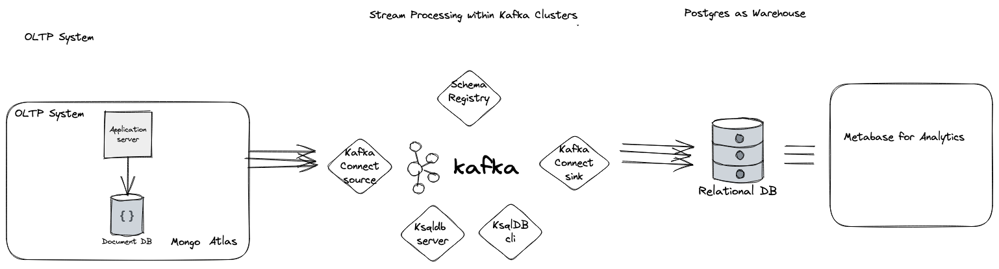

# Analysis of Cricket Data (Streaming)

## Objective

Build Data Stream Processing and Analytics using Kafka as message broker and Apache SuperSet as frontend. 

## Functional Requirements

- Data sources will generate events everytime a transaction is complete, this events must be consumed by kafka topic and let consumer aware of new events to process them in realtime.
- Each Data source must act as a Producer of events connect with Kafka Producer API.
- Each Data Sink must act as a Consumer of event stream and have a event processing system.
- The processed events must be dumped into a Data Warehouse for Analytics
- Analytics could be a SQL or Python + Visualization library.

## Non Functional Requirements

- The event streams won't be reproducible, system must be aware of it or build around it.
- Data sources can't be considered as ground truth, say Postgres crashes and repeats the events, system must be able to figure it out how to remove them.
- Data Sink must acknowledge after consumption.
- Message Broker - kafka must not be used as Database.
- Analytics must update with new data.

## Technical Approach

-  The data system should consists of 3 data source: yaml + AWS Lambda, CSV + Supabase + Postgres Events, Json + MongoDB Atlas.
-  A local process will create a infra using above services with terraform and a script upload data.
-  Every data will uploaded as single transaction to simulate a production database transaction and events being fired for every new data points.
-  At one point we have a 3 events to be processed in real time aka data stream.
-  Use Kafka locally hosted to store the events in topics and let stream processors handle it.
-  You could use any stream processing tool: Kafka Stream - Python Faust, KSQL or Apache Flink or simple Python Script.
-  Dump into a DuckDb OLAP warehouse
-  Connect a Apache SuperSet, its supports DuckDB connector

## High Level Design - Streaming Analytics

## Components

Todo

