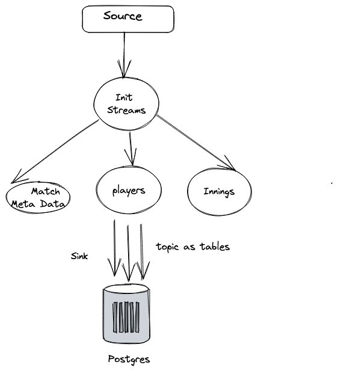

# Analysis of Cricket Data (Streaming) - V2

## Objective 

Build Stream Processing and Analytics using Kafka as message broker, ksqlDB as stream processing framework, Postgres as Warehouse.  

## Functional Requirements

- OLTP system will generate events every time a transaction commits, Kafka Source Connector will poll for new events and send to Kafka Broker.
- A stream processing framework will apply enhancing / transformation on streams.
- Each stream's topic would be dumped into Warehouse.
- Metabase to visualize data will read up from warehosue for analytics.

## Non Functional Requirements

- The event streams won't be reproducible, system must be aware of it or build around it.
- Data sources can't be considered as ground truth, say Postgres crashes and repeats the events, system must be able to figure it out how to remove them.
- Data Sink must acknowledge after consumption.
- Message Broker - kafka must not be used as Database.
- Analytics must update with new data.

## Technical Approach

-  The data system should consists of 3 data source: yaml + AWS Lambda, CSV + Supabase + Postgres Events, Json + MongoDB Atlas.
-  A local process will create a infra using above services with terraform and a script upload data.
-  Every data will uploaded as single transaction to simulate a production database transaction and events being fired for every new data points.
-  At one point we have a 3 events to be processed in real time aka data stream.
-  Use Kafka locally hosted to store the events in topics and let stream processors handle it.
-  You could use any stream processing tool: Kafka Stream - Python Faust, KSQL or Apache Flink or simple Python Script.
-  Dump into a DuckDb OLAP warehouse
-  Connect a Apache SuperSet, its supports DuckDB connector

## High Level Design - Streaming Analytics

## Components

#### OLTP System

- Have a python script which will act as application server, every 5 seconds dump a new data record
- JSON object to MongoDB
- CSV row into Supabase Postgres
- AWS Lambda local storage has 10gb limit, create lambda function with terraform, add a python script to iterate every 5 seconds to act as a object storage emitting events.
- Use Terraform to create infra for above OLTP system.

#### Event Broker - Kafka

- Setup Kafka on Docker localhost, which will ingest all producers of OLTP.
- Events will available in topics

#### Stream Processing

- Once data is available in Kafka topics, either use a consumer to process the events and dump to another topic or use KSQL for stream processing.
- For v1, a simple Python Script and KSQL.

#### Data Warehouse and Analytics

- A kafka consumer will dump data into DuckDb to store processed streams
- Apache Superset connect to warehouse and perform analyses on data.

## Data

- Json -> T20 Internationals-men
- CSVs -> One day Matches
- Yaml -> Test Matches

## Version 2

- MongoDB Json + MongoDB Atlas without terraform
- Kafka Local Setup
- Kafka Connectors for Mongo + Postgres 
- Kafka Schema Registry to make topic schema consistent across consumers and producers
- ksqlDB for stream processing
- Postgres to store processed stream
- Metabase

## Tasks

- [x] MongoDB Atlas project creation, manually.
- [x] Python Script as Application code to dump Json object to Atlas
- [x] (infra)Kafka setup on local as containers
- [x] (infra) Kafka Connect Docker 
- [x] (infra)Kafka Scheama Registry
- [x] Split source mongo topic into 3 topics: equivalent of datasets and dump to DuckDb
- [x] Transform Json into Table Record with ksqlDB
- [x] (infra)DuckDB creation
- [x] (infra)Apache Superset Docker
- [x] End to End system
- [ ] Extra: Testing in stream processing??

## Analysis:

#### Topic Segregation 
- Extract Match meta data into a topic
- Extract Player data into a topic
- Extract Innings Data into a topic
- One topic from Mongo stream processed into 3 topics using Python Script

## How to Run on Local

Create Mongo Atlas Account on their platform, use default cluster0, create a database user, whitelist your own IP in network access, get Mongo URI and create + append in .env file

> `MONGO_URI=mongodb+srv://<user>:<password>@<cluster_name>.mongodb.net`

Install Python dependencies:

> `pip install -r requirements.txt`

Start Kafka Local Docker container, creates DuckDB OLAP file:

> `make setup-local-infra`

Import Mongo Connectors and Postgres Connectors into Kafka Connect to source and sink data

> `python -m stream_processors.load_connectors`

Run Mongo makeshift OLTP system, which dumps document to Atlas and its events are picked by kafka

> `python -m application_server.dumpToMongo`

Create Init Stream, which will unpack json string into a stream, easy to extract in next steps. Run Transformation stream processing as well.

> `python -m stream_processors.create_init_streams && python -m stream_processors.transform_match_metadata`

You can run manual docker ksql queries inside docker instead of above python client.

> `docker exec -it ksqldb-cli ksql http://ksqldb-server:8088`
 
Check Metabase at `localhost:3000` for data being dumped at `example` database. 

Check logs
> `tail -f loggers/system.log`

Install Confluent Hub Plugins:

- download zip file, copy into same path as connect plugin env path, install with confluent-hub install *.zip, restart the container
- create source or sink in ksqldb cli.

#### References:

- [Mongo Connector Config properties](https://www.mongodb.com/docs/kafka-connector/current/source-connector/configuration-properties/all-properties/)
- [Mongo Source Connector Config](https://www.mongodb.com/docs/kafka-connector/current/tutorials/source-connector/)
- [ksqlDb - Too many cooks in the kitchen](https://ksqldb.io/overview.html  )
- [kafka connectors additon to docker, pain](https://www.youtube.com/watch?v=CcHn_V5Sm8c)
- [Confluent-hub installation of connectors](https://docs.confluent.io/kafka-connectors/self-managed/confluent-hub/client.html#install-while-offline-using-a-zip-file)

#### Problems faced:

- There some data transformation function missing, like unnest of bigquery, array to column. But we can fallback to python basic consumer and producer clients.